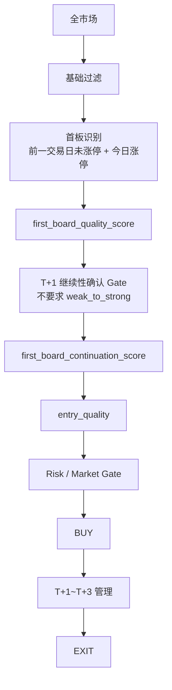

# First Board Continue 首板延续策略（独立策略包）

独立于 `strong_diverge` / `momentum` / `swing` 的策略包，专做 **首板 → T+1 延续**。

## 链路



## 关键 Score / Gate

| 概念 | 回答 |
|---|---|
| `first_board_event` | 是否真正首板（前一交易日未涨停 + 今日涨停） |
| `first_board_quality_score` | 首板质量（封板/板块/换手/价格位置/首板前动量） |
| `first_board_continuation_confirmed` | T+1 正常延续 Gate 是否通过 |
| `first_board_continuation_score` | T+1 延续强度 |
| `entry_quality_score` | 当前价格是否值得买 |

## 运行
```bash
# 单日
.venv/bin/python scripts/first_board_continue_backtest.py --date 2026-08-18 --symbols-limit 200

# 多日回放
.venv/bin/python scripts/first_board_continue_backtest.py \
  --start 2026-08-11 --end 2026-08-18 --symbols-limit 200 \
  --output-dir agents_workspace_first_board_continue

# 统一入口
.venv/bin/python scripts/strategy_backtest.py --strategy first_board_continue --run-replay \
  --start 2026-06-01 --end 2026-08-18
```
