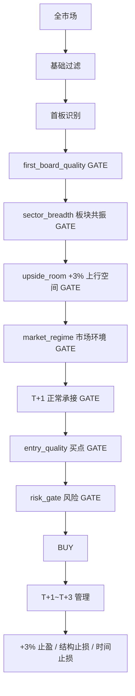

# First Board Continue 首板延续 +3% 策略

独立策略包，与 strong_diverge 分离。

- 目标：P(MFE[T+1,T+3] >= +3%) 最大化；控制亏损（MAE、止损）。
- 首板识别：前一交易日未涨停 + 今日涨停（`first_board_event`）。
- Gate 顺序：首板质量 -> 板块共振 -> 上行空间(+3%) -> 市场环境 -> T+1 继续性确认 -> 入场质量 -> 风险。
- 不用 buy_score 单分决定买入，Gate 全过才 `BUY`。
- T+1 只要求正常承接，不要求 weak-to-strong。
- 回测标签：`MFE_T1/T2/T3`, `MAE_T1/T2/T3`, `CloseReturn_T1/T2/T3`, `Target_3`。

调整入口：`strategies/first_board_continue/strategy.yaml`
MDKILL
cat > strategies/first_board_continue/README.md <<'MD'
# First Board Continue +3%（首板延续）

目标：**P(MFE[T+1,T+3] >= +3%)**，不找龙头、不预测二板三板、不预测收盘价。

## 链路


## Gate 说明
| Gate | 作用 | 默认 |
|---|---|---|
| `first_board_quality` | 封板/炸板/换手/位置 | score>=60 |
| `sector_breadth` | 板块共振，不是孤立行情 | score>=50 |
| `upside_room` | +3% 空间；距压力位不足+3%直接淘汰 | min 3% |
| `market_regime` | 市场情绪开关 | 缺数据默认放行 |
| `continuation` | T+1 正常承接（不要求弱转强） | gates>=3 |
| `entry_quality` | 当前价格值不值得买 | score>=70 |
| `risk` | ST/极端爆量/远离MA20 | score>=50 |

## 回测标签
P0：每条 BUY 信号必须记录：
- 实际 Entry（如 T+1 开盘/确认价）
- `MFE_T1/T2/T3`, `MAE_T1/T2/T3`
- `CloseReturn_T1/T2/T3`
- `Target_3 = MFE(T+1~T+3) >= +3%`

MFE/MAE 必须相对**实际买点**计算，不能直接用首板后最高价。

## 运行
```bash
# 单日
.venv/bin/python scripts/first_board_continue_backtest.py --date 2026-08-18 --symbols-limit 200

# 多日回放
.venv/bin/python scripts/first_board_continue_backtest.py \
  --start 2026-08-11 --end 2026-08-18 --symbols-limit 200 \
  --output-dir agents_workspace_first_board_continue
```
