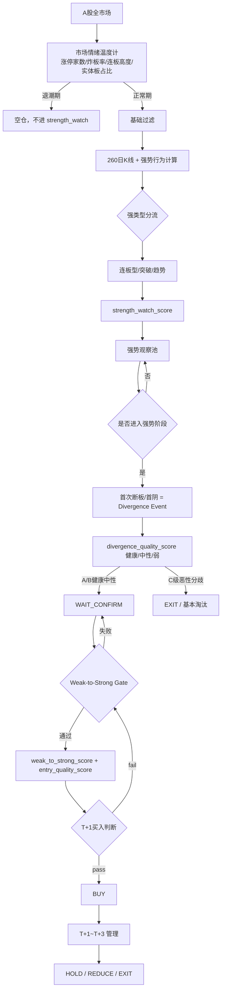

# Strong Diverge 强势分歧龙头战法（独立策略包）

本策略包完全独立，不依赖旧 `main_loop` / `ResearchAgent` / `ConsensusAggregator` 链路。

## 核心设计

v3 不再用“单一综合分”直接买入。系统按生命周期依次通过 Gate：



### 状态机 + 评分（而不是纯评分）

- `first_non_board_date` / `first_negative_after_strength`：只有强势阶段结束后**第一次**
  不涨停 / 收阴才产生 `divergence_event`。今天跌 ≠ 首阴，今天没涨停 ≠ 断板。
- `divergence_event`：明确的分歧成立条件 = 强势生命周期 + 第一次不涨停 / 第一次收阴；
  质量评分与事件成立**分开**，不再用“今天是不是跌了”充当分歧本身。
- `divergence_quality_score` / `divergence_grade`：只回答这次分歧健不健康，分为
  `A类=健康断板/健康分歧`、`B类=中性断板/中性分歧`、`C类=弱断板/弱分歧`。
  `C级恶性分歧直接走 EXIT / 基本淘汰`，不进入 WAIT_CONFIRM。
- `weak_to_strong_confirmed`：必须满足硬条件 Gate（默认 5 选 4）才允许进入 T+1 候选；
  高分但没通过 Gate 仍不可买入。
- 严格 Gate 语义：
  1. 站上开盘价：收盘>=开盘；
  2. 站上VWAP：收盘>=VWAP（缺失不退化为 MA5）；
  3. 回踩VWAP成功：盘中回踩 VWAP 且收盘>VWAP，且 最低价距 VWAP 在容差内；
  4. HH/HL 短线结构：最近两个已完成交易日高点抬高 AND 低点抬高；
  5. 量价确认：上涨放量 或 回调缩量+站上MA5。
- `entry_quality_score`：只回答这个价格值不值得买，不再重复计 VWAP / MA5 / 量比。

### 四个模块职责

| 模块 | 回答的问题 | 主要因子 |
|---|---|---|
| strength_watch_score | 谁已经强、值得等分歧 | 连板、突破、成交额、换手、板块 |
| divergence_quality_score / divergence_grade | 这次分歧健不健康 / 等级 A·B·C | 首次断板/首阴、涨幅/跌幅、量、收盘位置、关键位 |
| weak_to_strong_score | 分歧后有没有重新获得资金认可 | 开盘价、VWAP、回踩、HH/HL、量价 |
| entry_quality_score | 现在这个价格值不值得买 | 当前涨幅、距涨停/前高、止损/目标空间、风险回报 |


### 断板分级（divergence_grade）

| 等级 | 名称 | 条件 | 处理 |
|---|---|---|---|
| A类 | 健康断板 | 连续涨停后第一次不涨停，涨幅仍为正(如+5%)、缩量、收盘位置高 | 非常值得观察 |
| B类 | 中性断板 | 连续涨停后 +1%/0%、量能正常 | 观察即可 |
| C类 | 弱断板 | 大跌、放量、跌破关键位/早盘炸板失败 | 基本淘汰 |

### Weak-to-Strong 严格 Gate（5 选 4）

| Gate | 严格定义 |
|---|---|
| Gate 1 站上开盘价 | 当日收盘 >= 开盘 |
| Gate 2 站上VWAP | 当日收盘 >= VWAP；缺失时不得退化为 MA5 |
| Gate 3 回踩VWAP成功 | 盘中 `low<=VWAP`，收盘 `>=VWAP`，且 `low` 距 `VWAP` 在容差内（ATR×1.5 或 2%） |
| Gate 4 HH/HL 短线结构 | 最近两个已完成交易日：高点抬高 `AND` 低点抬高（HH ↑ & HL ↑） |
| Gate 5 量价确认 | 上涨放量 或 回调缩量 + 站上 MA5 |

只有 **≥4 个** 通过才允许 `weak_to_strong_confirmed=True`。


## 三类强势行为

| 类型 | 优先级 | 评分核心 | 目的 |
|---|---|---|---|
| 连板型 | 最高 | 连板数、封单强度、炸板次数、一字 | 等待首阴/断板做分歧接力 |
| 突破型 | 中 | 20/60日新高、突破幅度、量价 | 抓趋势初期 T+1~T+3 |
| 趋势启动型 | 最低（降权） | 周线/RS 只做启动，MA20 偏离高则减分 | 防止追已透支 |

### strength_watch_score vs setup_score
- `strength_watch_score`：**谁已经强**，决定是否能进观察池
- `setup_score`：**分歧/弱转强准备度**，观察期进一步评估


### 市场温度计（周期前置闸门）

- 全市场 → 情绪温度计（涨停家数 / 炸板率 / 最高连板 / 实体板占比）。
- 默认阈值：涨停家数≥40、炸板率<35%、最高板≥3、实体涨停占比≥40%。
- 任一不满足 → 退潮期，直接空仓，不进 `strength_watch`。
- 参数：`strategies/strong_diverge/strategy.yaml` 下的 `market:`。

### T+1~T+3 管理（HOLD / REDUCE / EXIT）

- `HOLD`：继续持有（未触发减仓/卖出条件）。
- `REDUCE`：回撤过大（默认 -3% 且持有≥2天）时先减仓一半观察，不直接清仓。
- `EXIT`：严格止损（默认 -6%）、止盈、移动止损、超期等硬条件触发后卖出。
- 初始止损位：若 `Holding.stop_loss_price` 已填（例如分歧日最低点 / T+1 确认日关键位），
  跌破该价时无条件清仓，优先于 -6% 全局止损。

## 目录

- `strategy.yaml`：全部业务参数。
- `engine.py`：独立规则引擎（三池分流 + 后续分歧/买入/卖出）。
- `schemas.py`：独立数据结构。
- `beliefs.yaml`：研究信念（当前规则引擎不强制使用 LLM）。
- `tools.yaml`：当前不需要研究工具。
- `SKILL.md`：给 Codex 的开发说明。

## 运行

### 单日
```bash
.venv/bin/python scripts/strong_diverge_backtest.py \
  --date 2026-08-18 --symbols-limit 200 --output-dir run_strong_diverge
```

### 多日
```bash
.venv/bin/python scripts/strong_diverge_backtest.py \
  --start 2026-08-11 --end 2026-08-18 --symbols-limit 200 \
  --output-dir agents_workspace_strong_diverge
```

### 统一回测入口
```bash
.venv/bin/python scripts/strategy_backtest.py --strategy strong_diverge --run-replay \
  --start 2026-06-01 --end 2026-08-18 --output-root agents_workspace_strategies
```

## 测试
```bash
.venv/bin/python -m unittest test_strategy_strong_diverge -v
```
